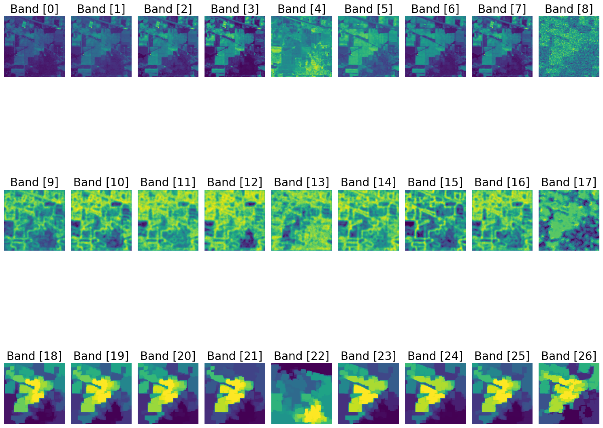

# Indian Pines: HSI to MSI and Spatial Features

**Camilo Acevedo-Correa**

Python tutorial for reducing a hyperspectral image (HSI) cube by averaging channels within wavelength intervals, then extracting local entropy and mathematical morphology features.

[](https://colab.research.google.com/github/camiloace/indian-pines-hsi-to-msi/blob/main/preprocessing_indian_pines.ipynb)

## Output dimensions

| Input | Aggregated bands | MSI + entropy + morphology |
|---|---:|---:|
| Corrected Indian Pines, 145×145×200, with the standard channel mapping | 8 | 24 |
| Full 220-channel cube, with aligned wavelength calibration | 9 | 27 |

**Why the output differs from the original notebook:** the original retained 201 wavelengths for 200 bands. Also, B9 (1360–1390 nm) relies on original channels 104, 105, and 106, which are removed in the standard 200-band version. The revised workflow explicitly skips this interval or raises an error when all intervals are required. It does not fill in a missing band. A 220-channel cube can cover all nine intervals, although the absorption region may have poor data quality.

The 200-channel mapping is an **assumption that must be checked against the file's provenance**: original channels 104–108, 150–163, and 220 are excluded, using 1-based numbering. If your copy was modified, provide its original channel identifiers. The cube dimensions alone do not verify the mapping.

## Visual results: entropy and morphology

The figure below, provided by Camilo Acevedo-Correa, shows the original workflow's 27-channel output.



- **Top row — Band [0] to Band [8]:** the nine aggregated MSI bands show intensity patterns across the scene.
- **Middle row — Band [9] to Band [17]:** local entropy maps highlight texture variation, including transitions between more uniform regions and areas with greater local variability.
- **Bottom row — Band [18] to Band [26]:** morphology maps simplify fine detail and emphasize the spatial structure of larger regions.

The colors visualize values within each image; they are not land-cover class labels. The labels “Band [0]” through “Band [26]” index the combined feature cube, including the derived entropy and morphology channels.

**About this example:** this is a result from the original nine-band workflow. With corrected Indian Pines and the standard 200-channel mapping, the revised notebook produces 8 MSI bands, 8 entropy maps, and 8 morphology maps (24 channels total), because B9 has no samples.

## Run in Google Colab

1. Open the Colab link above.
2. Run the setup cell to clone this repository and install the dependencies.
3. [Download Indian_pines_corrected.mat](https://huggingface.co/datasets/danaroth/indian_pines/resolve/main/Indian_pines_corrected.mat?download=true) and upload it when the notebook prompts you.
4. Review the channel mapping and run the remaining cells in order.
5. Download the outputs from `indian-pines-hsi-to-msi/results/` in the Files panel.

You do not need to mount Google Drive. To use a different dataset variant, update `MAT_PATH`, `MAT_KEY`, and `channel_ids`. The notebook explanations are currently in Spanish.

## Run locally

Python 3.12 is recommended. Run the following commands in a terminal:

```bash
git clone https://github.com/camiloace/indian-pines-hsi-to-msi.git
cd indian-pines-hsi-to-msi
python -m venv .venv
```

Activate the environment with `.venv\Scripts\Activate.ps1` in Windows PowerShell, or `source .venv/bin/activate` on Linux/macOS. Then run:

```bash
python -m pip install -r requirements.txt
python -m pip install jupyterlab
python -m jupyterlab
```

Place the MAT file in `data/` and open `preprocessing_indian_pines.ipynb` from the repository root. The exact package versions used for validation are recorded in `requirements-tested.txt`.

## Repository files

- `preprocessing_indian_pines.ipynb`: revised tutorial.
- `hsi_processing.py`: band aggregation and spatial processing functions.
- `notebook-original-sin-salidas.ipynb`: original code preserved for historical reference, with saved outputs removed. It retains the original errors and requires additional dependencies such as `spectral`. Use the revised tutorial to run the workflow.
- `data/wavelenght.csv`: original wavelength table for 220 channels; the author's filename is preserved.
- `tests/test_processing.py`: checks for channel alignment, empty intervals, and constant inputs.
- `REVISION.md`: changes, validation results, and verification limits, in Spanish.

## Method

The workflow uniformly averages channels within each interval from the original notebook (nm): 433–453, 450–515, 525–600, 630–680, 845–885, 1560–1660, 2100–2300, 500–680, and 1360–1390. Some intervals overlap.

Local entropy is computed from globally normalized intensities quantized to 8 bits, using a disk with a radius of 4 pixels. Each entropy map is divided by its maximum. Morphology processes each band with two erosions, an opening, two dilations, and area closing/opening, using a 5×5 footprint and an area threshold of 1,000 pixels.

Averaging within wavelength intervals **approximates** a multispectral image (MSI). It does not simulate the full spectral response or spatial resolutions of Landsat 8. The final output combines intensity and spatial features; the added channels are not physical spectral bands. Improved classification accuracy has not been demonstrated and requires a separate experiment. Keep training and test spatial neighborhoods from overlapping, and fit any scaling using training data only.

## Saved results

For the standard 200-channel input, the notebook writes `results/IP_MSI_8.mat` and `results/IP_FEATURES_24.mat`. For a 220-channel input, it writes the corresponding files with 9 and 27 channels. It also saves `processing_metadata.json` and `preview.png`. The JSON file records channel indices, wavelengths, and processing parameters. Running the same configuration again replaces its previous outputs.

## Data, attribution, and license

Download [Indian_pines_corrected.mat from the public Hugging Face mirror](https://huggingface.co/datasets/danaroth/indian_pines/resolve/main/Indian_pines_corrected.mat?download=true) and place it in `data/`, or upload it when prompted in Colab. This mirror is maintained by a third party. The downloaded file was verified to match the MAT file used to validate this notebook byte for byte: 5,953,527 bytes, with dimensions 145×145×200.

SHA-256: `ec2f8808710919d566f70f0d4aa885aae1ddfd42b734aba71c5e12ca65450939`.

The [EHU scene collection](https://www.ehu.eus/ccwintco/index.php/Hyperspectral_Remote_Sensing_Scenes#Indian_Pines) is retained as a reference to the original source, but it returned HTTP 403 during our checks. The MAT cube is not redistributed in this repository.

The original publication by [Baumgardner, Biehl, and Landgrebe (2015), Purdue PURR](https://doi.org/10.4231/R7RX991C) includes the 220-channel calibration and is marked CC0. The CSV was compared row by row with the calibration document associated with the local dataset copy. This verifies the calibration values, but does not establish the MAT file's processing history.

The author has not yet selected a code license; an MIT license has not been added. Referenced materials retain their own terms of use.

## References

1. [Landsat 8 — NASA](https://science.nasa.gov/mission/landsat-8/).
2. [Hyperspectral Remote Sensing Scenes — EHU](https://www.ehu.eus/ccwintco/index.php/Hyperspectral_Remote_Sensing_Scenes#Indian_Pines).
3. [Image Processing with Python: Working with Entropy](https://towardsdatascience.com/image-processing-with-python-working-with-entropy-b05e9c84fc36).
4. [Morphological Operations — j-manansala](https://github.com/j-manansala/morphological/blob/main/Morphological%20Operations.ipynb).
5. [Original dataset and calibration — Purdue PURR](https://doi.org/10.4231/R7RX991C).

## Tests

```bash
python -m unittest discover -s tests -v
```


